# Build AI Agents with AI Toolkit


Livestream starting soon! **Click below to register.**

[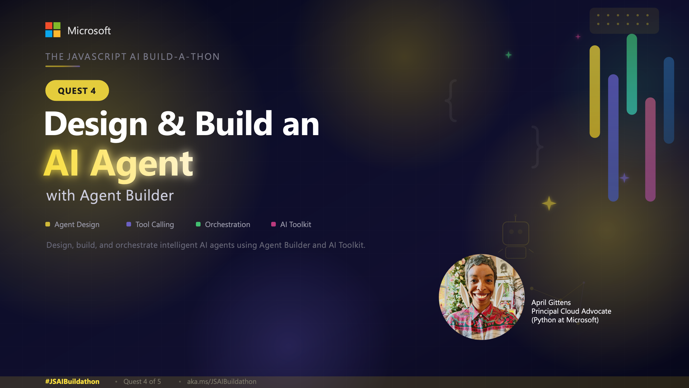](https://developer.microsoft.com/en-us/reactor/events/26776/)

## Overview

In this quest, you will build local AI agents using the **AI Toolkit for Visual Studio Code**. You'll explore the Model Catalog, compare models in the Playground, create agents with MCP tool integrations and evaluate their performance. Along the way, you'll use GitHub Copilot to get recommendations and scaffold a chat UI for your agent.

## AI Toolkit for VS Code

The **AI Toolkit** is a powerful VS Code extension that streamlines generative AI application development. It provides a unified interface for discovering models, building agents, and integrating AI capabilities into your applications, natively embedded in your workflow.

**Key Features:**

- **Model Catalog**: Access models from GitHub, OpenAI, Anthropic, Google, Ollama, Microsoft Foundry and Foundry Local
- **Playground**: Interactive environment for testing models with different prompts and parameters
- **Agent Builder**: Create agents with system prompts, variables, and MCP tool integrations
- **Evaluation**: Measure agent performance with built-in metrics
- **Code Export**: Export agent code for integration into applications

> [!NOTE]
>
> **Hackathon Award Category: Agent Architecture Award**
>
> As part of the Build-a-thon Hack!, we have a special award category that will recognize the best AI agents with innovative and well-architected designs.
>
> Consider building:
>
> - Agents that solve complex problems with multiple steps of reasoning
> - Agents that integrate with custom MCP servers to access specialized tools or data
> - Agents with sophisticated evaluation techniques that push performance boundaries
>
> Highlight in your submission how you:
>
> - Demonstrate innovative agent design patterns
> - Leverage MCP servers for specialized tool integration
> - Showcase evaluation methods that validate agent performance

### Install the AI Toolkit Extension

1. Open VS Code
2. Go to the Extensions view (`Cmd+Shift+X` on macOS / `Ctrl+Shift+X` on Windows)
3. Search and install the **AI Toolkit** extension

## Explore Models in the Model Catalog

The Model Catalog is your gateway to discovering AI models from multiple providers. Let's explore what's available and add models to your toolkit.

### Browse the Model Catalog

1. Click the **AI Toolkit** icon in the Activity Bar
2. Expand **Model Tools > Model Catalog** to open the Model Catalog
3. Use the filters to narrow down models:
   - **Hosted by**: GitHub, ONNX, OpenAI, Anthropic, Google, Microsoft Foundry etc.
   - **Publisher**: Microsoft, Meta, Google, OpenAI, Mistral AI
   - **Feature**: Text Attachment, Image Attachment, Web Search, Structured Outputs
   - **Model type**: Remote, Local (CPU/GPU/NPU)

    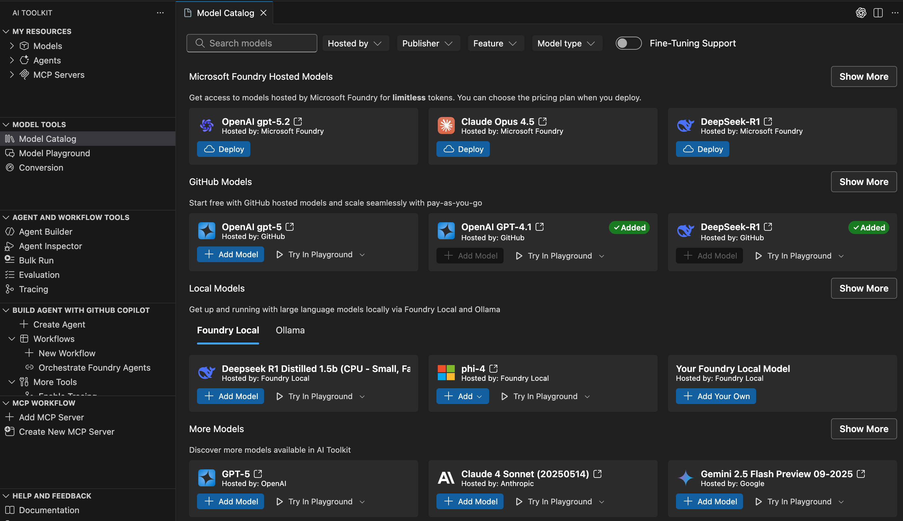

### Add a Model from GitHub

GitHub-hosted models are perfect for getting started as they're free to use within rate limits.

1. In the Model Catalog, find a model like **OpenAI GPT-5-nano**
2. Click **Add Model** and a green **Added** badge appears
3. The model now appears under **My Resources > Models** in the tree view, and you can click on **Try in Playground** to test it out

> **Tip**: AI Toolkit supports GitHub pay-as-you-go models, so you can continue working after passing free tier limits by enabling billing in your [GitHub settings](https://github.com/settings/billing).

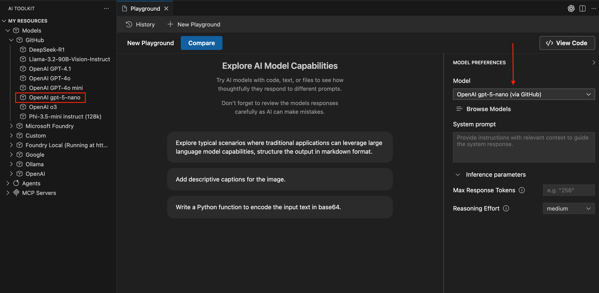

## Compare Models in the Playground

The Playground provides an interactive environment to test models, configure parameters, and compare responses side-by-side.

### Test a Model

You are already in the **Model Playground,** with the selected model pre-loaded in the Model field.

1. Add a **System Prompt** to define the model's behavior. Example

    ```plaintext
    You are Cora, an intelligent and friendly AI assistant for Zava, a home improvement brand. You help customers with their DIY projects by understanding their needs and recommending the most suitable products from Zava’s catalog.​

    Your role is to:​

    - Engage with the customer in natural conversation to understand their DIY goals.​
    - Ask thoughtful questions to gather relevant project details.
    - Be brief in your responses.​
    - Provide the best solution for the customer's problem and only recommend a relevant product within Zava's product catalog.​
    - Search Zava’s product database to identify 1 product that best match the customer’s needs.​
    - Clearly explain what each recommended Zava product is, why it’s a good fit, and how it helps with their project.​
    ​
    Your personality is:​

    - Warm and welcoming, like a helpful store associate​
    - Professional and knowledgeable, like a seasoned DIY expert​
    - Curious and conversational—never assume, always clarify​
    - Transparent and honest—if something isn’t available, offer support anyway​

    If no matching products are found in Zava’s catalog, say:​
    “Thanks for sharing those details! I’ve searched our catalog, but it looks like we don’t currently have a product that fits your exact needs. If you'd like, I can suggest some alternatives or help you adjust your project requirements to see if something similar might work.”​
    ```

2. You can optionally adjust inference parameters:
   - **Temperature**: Controls randomness (lower = more deterministic)
   - **Top P**: Controls diversity of output
   - **Max Response Tokens**: Limits token count
   - **Reasoning effort**: Only for reasoning-capable models to adjust depth of reasoning

3. Enter a prompt and click **Send**. Example:

    ```plaintext
    Describe what's in the image, including colors of the objects and their positions.
    ```

    You can download a demo image from [here](./demo-living-room.png) and attach it in the chat.

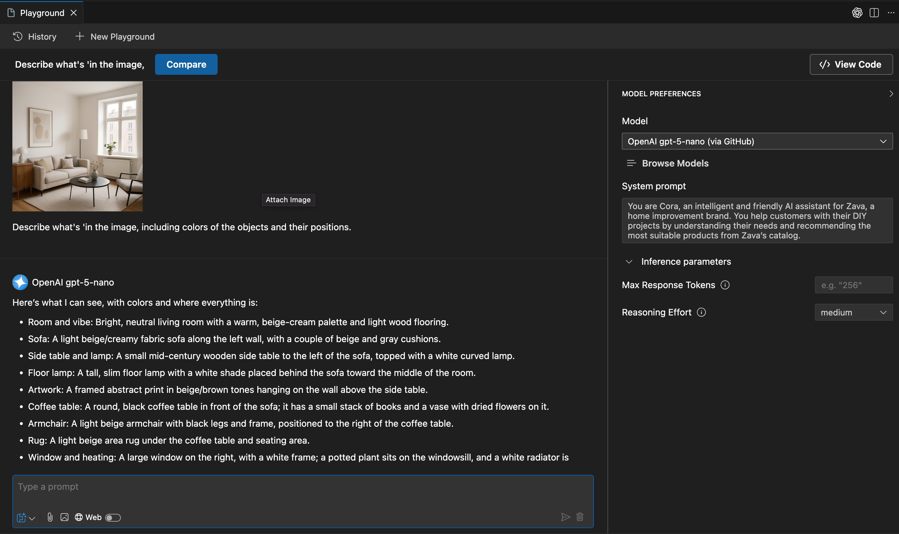

## Compare Models Side-by-Side

> [!NOTE]
> But what if you don't know **which model** is best for your exact use case?

### Use GitHub Copilot for Model Recommendations

Open GitHub Copilot Chat (`Cmd+Shift+I`) and ask for model recommendations:

```plaintext
I'm building a customer support chatbot that needs to provide accurate information about our company and assist with product recommendations. Which AI models from the AI Toolkit Model Catalog would you recommend for this use case?
```

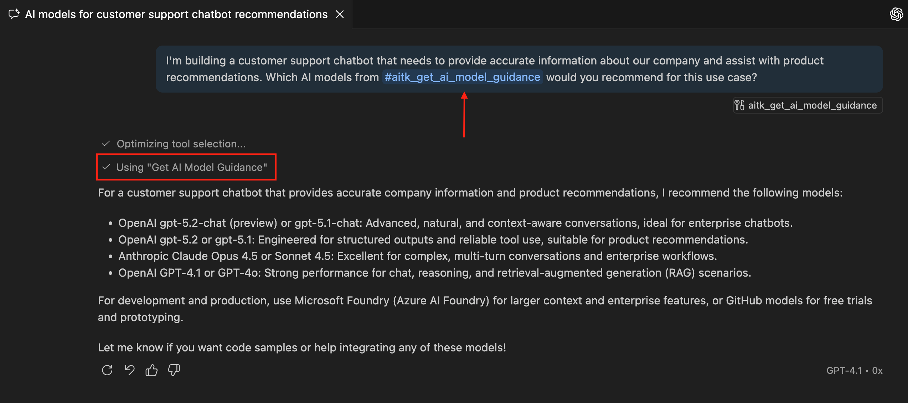

The GitHub Copilot Agent analyzes your use case, and uses the `Get AI Model Guidance` tool from the extension features to suggest the best model based on capabilities, cost, and performance characteristics.

You can then use the **Compare** feature to evaluate how the recommended or different models respond to the same prompt:

1. Click the **Compare** button in the Playground toolbar
2. Select one of the recommended models to compare. Example **GPT-4.1**
3. With the combined model's view, your prompt will be sent to both selected models simultaneously
4. Review responses side-by-side to evaluate quality, style, and accuracy

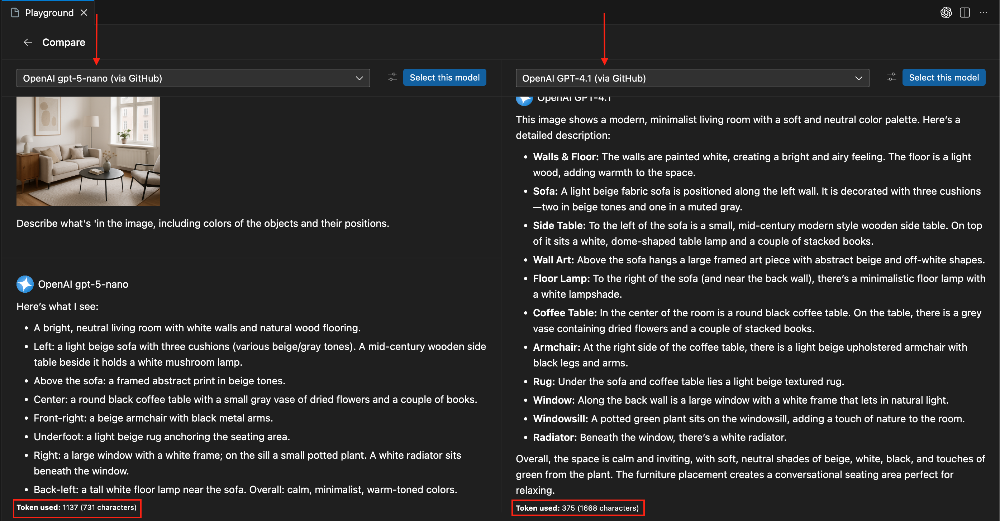

## Build an Agent with Agent Builder

Agent Builder streamlines the process of creating AI agents with custom instructions, variables, and tool integrations.

### Create Your First Agent

1. Select **Agent and Workflow Tools > Agent Builder** from the AI Toolkit view
2. Give the agent a name: Example `Cora-Support-Agent`
3. Choose a model from the **Model** dropdown
4. Define your agent's instructions in the **Instructions** field. _You can use the same system prompt from the Playground example above._
5. Enter a test prompt: *"Describe what's in the image, including colors of the objects and their positions."*
6. Click **Send** to test your agent

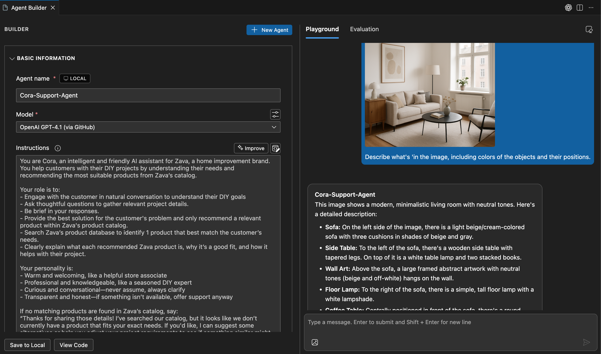

### Add Dynamic Variables

Variables allow you to personalize agent responses dynamically:

1. Add a variable `{{user_name}}` in your instructions by modifying the prompt:

    ```plaintext
    ...
    Your role is to:​
    - Engage with the customer in natural conversation to understand their DIY goals. **Always greet the user by name: {{user_name}}.**​
    ...
    ```

2. Define the value in the **Variables** section below. Variables are replaced at runtime, enabling dynamic behavior
3. Re-Enter a test prompt
4. Click **Send** to test your agent

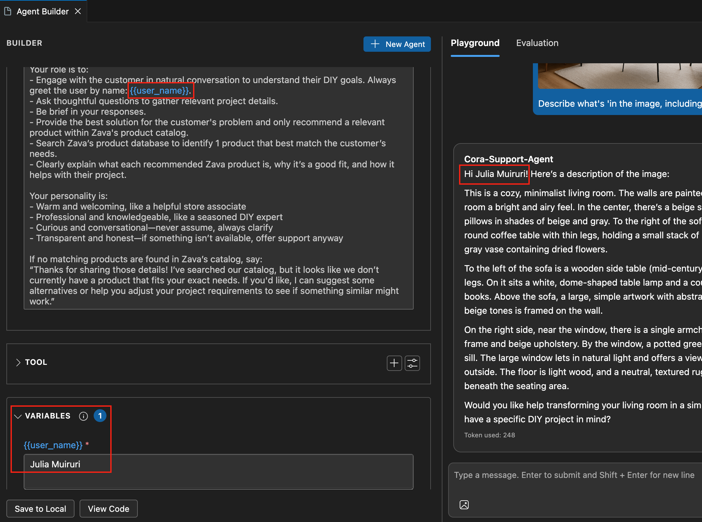

## Integrate MCP Servers for Tool Use

**Model Context Protocol (MCP)** servers extend your agent's capabilities by connecting to external APIs, databases, and services.

### Connect to a Featured MCP Server

AI Toolkit includes pre-configured MCP servers you can use immediately:

1. In the **Tools** section, click **+** and select **MCP Server**
2. Choose **aitk-playwright-example**
3. Click on the **Edit Tool List** button to view the list of configured tools available through the Playwright MCP Server. The server tools are now available to your agent.

  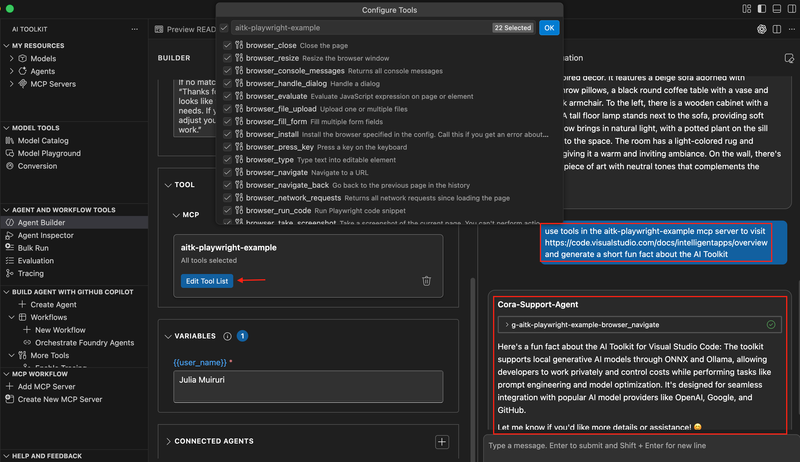

### Connect to an Existing MCP Server

You can connect to any MCP server that follows the protocol, following the steps in the GIF below:


### Create a New MCP Server (TypeScript)

AI Toolkit can scaffold a new MCP server project for you:

1. In the **MCP Workflow** section, select **Create New MCP Server**
2. Choose the **typescript-weather** server template
3. Select a folder for your project
4. Enter a name (e.g., `weather-mcp-server`)

AI Toolkit generates a scaffold with:

- Basic MCP protocol implementation
- Tool registration example
- Package.json with dependencies

### Test Your MCP Server in Agent Builder

1. Open the VS Code **Debug** panel
2. Select **Debug in Agent Builder** or press `F5`
3. The server automatically connects to Agent Builder

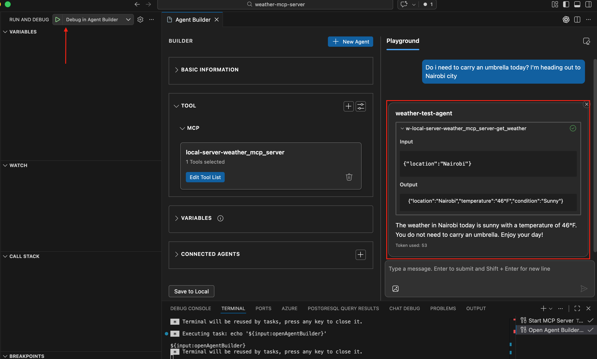

---

## Evaluate Agent Responses

Evaluation helps you measure and improve your agent's performance systematically.

### Run a Bulk Test

Test your agent against multiple inputs using the Bulk Run feature:

1. In Agent Builder, switch to the **Evaluation** tab
2. Click **Generate Data** to create a synthetic test dataset
3. Choose the number of test rows (e.g., 10)
4. Review and modify the data generation logic if needed
5. Click **Generate** to create the dataset
6. Check the **select all** box and click **Run Response** to execute all test cases


### Manual Evaluation

After running tests, manually evaluate responses:

1. Click **View Details** on any row to see the full response
2. Use **Thumbs Up** or **Thumbs Down** in the Manual column to rate quality
3. Navigate between responses using Previous/Next buttons
4. Your ratings are saved for comparison

### AI-Assisted Evaluation

Use built-in evaluators to automate quality assessment:

1. Click **New Evaluation**
2. Select evaluators from the list:
   - **Intent Resolution**: How well did the agent understand the request?
   - **Task Adherence**: Did the agent complete the intended task?
   - **Tool Call Accuracy**: Were the correct tools selected?
   - **Coherence**: Is the response logically consistent?
   - **Fluency**: Is the language natural and readable?
   - **F1 Score**: Token overlap with ground truth
   - **BLEU/GLEU/METEOR**: Translation quality metrics

3. Select a **judging model** for AI-assisted evaluation
4. Click **Run Evaluation**

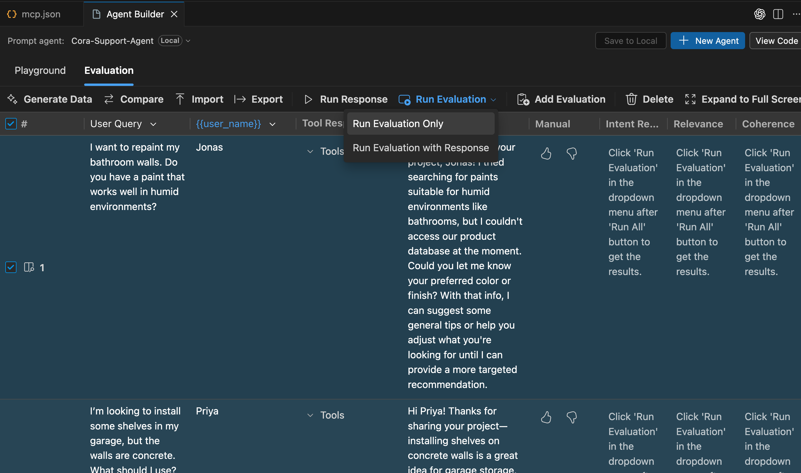

### Use GitHub Copilot for Evaluator Recommendations

Ask Copilot Agent Mode which evaluators fit your use case:

```
@workspace I'm evaluating a customer support agent that needs to provide 
accurate technical information and maintain a friendly tone. Which AI Toolkit 
evaluators should I use, and should I create any custom evaluators?
```

### Compare Versions

Track improvements by saving and comparing versions:

1. After refining your agent, click **Save as New Version**
2. Give it a descriptive name (e.g., "v2-improved-prompts")
3. Click **Compare** to view evaluation results side-by-side
4. Identify which version performs better across metrics


## Export Code

Once your agent is refined, export code for integration into your application.

1. Click **View Code** in the Agent Builder toolbar
2. Select your preferred SDK:
   - **Azure AI Inference SDK**
   - **OpenAI SDK** (works with OpenAI-compatible APIs)
3. Select your preferred programming language

Save the code file in your working directory, i.e., `cora-agent.js`

## Build a Chat UI with GitHub Copilot ✨

Your agent code is now ready for integration! Let's create a high-quality chat interface using GitHub Copilot. Ensure you are in **Agent Mode**

1. Copy the entire prompt below and paste in the GitHub Copilot Chat window.
2. Let it cook!
3. Review the generated code and make adjustments as needed
4. Follow provided steps to install dependencies, run the server, and open the chat UI

### Chat UI Scaffold Prompt

```
Create a complete chat application with two parts: a Node.js API server and a standalone HTML chat UI.

Reference the exported agent code in #cora-agent.js for integration.

## Part 1: API Server (server.js)

**Framework & Setup**
- Use Node.js built-in http module for the server (no Express needed)
- Keep server code minimal - under 100 lines
- Handle CORS for local development
- Parse JSON request bodies manually (no body-parser)
- The agent code from #cora-agent.js will have its own dependencies (Azure AI SDK, OpenAI SDK, etc.)

**Server Requirements**
- Import and integrate the agent code from #cora-agent.js
- Expose POST /api/chat endpoint
- Accept JSON payload: { "message": "user message text", "history": [...] }
- Call the agent with the user message
- Return JSON response: { "message": "agent response text" }
- Support both streaming and non-streaming responses
- Include error handling for agent failures
- Log requests to console for debugging

**Package.json Setup**
- Create package.json with type: "module" for ES modules
- Include dependencies from #cora-agent.js (e.g., @azure/ai-inference, openai, etc.)
- Add start script: "node server.js"

**Code Structure for server.js**
1. Import the agent code from #cora-agent.js at the top
2. Create HTTP server with request handler
3. Handle OPTIONS requests for CORS preflight
4. Parse POST /api/chat requests
5. Call agent with user message and conversation history
6. Send agent response back as JSON
7. Start server on port 3000

**Error Handling**
- Return 400 for invalid JSON
- Return 404 for unknown routes
- Return 500 for agent errors with error message
- Handle stream interruptions gracefully

## Part 2: Chat UI (chat.html)

**Setup & Performance**
- Single HTML file that can be opened directly in a browser
- Use Tailwind CSS via CDN (no npm required)
- Pure vanilla JavaScript (no frameworks)
- Total file size under 50KB
- Works offline after initial load

**Chat Features**
- Text input field with send button (Send on Enter)
- Display chat messages as bubbles (user on right in blue, assistant on left in gray)
- Auto-scroll to the latest message
- Show timestamp for each message (HH:MM format)
- Loading spinner while waiting for response
- Clear conversation button
- Copy-to-clipboard button on each assistant message
- Display errors gracefully if the agent fails
- Maintain conversation history in memory for context

**UI/UX Standards**
- Responsive mobile-first design (works on phone, tablet, desktop)
- Smooth fade-in animations for new messages
- Disabled input while loading
- Visual feedback on button hover
- Message input focus on page load
- Keyboard accessibility (Tab navigation, Enter to send)

**Code Structure for chat.html**
1. HTML with Tailwind CDN in &lt;head&gt;
2. Chat container with messages area and input form
3. &lt;script&gt; section with:
   - API configuration (endpoint: http://localhost:3000/api/chat)
   - conversationHistory array to track messages
   - sendMessage() function that POSTs to server with message and history
   - addMessage() to append messages to UI
   - showLoading(), hideLoading() for loading state
   - clearChat() to reset conversation
   - Event listeners for send button and Enter key

**Integration**
- Fetch API to call POST /api/chat with user message and history
- Handle fetch errors and display to user
- Parse JSON response and display agent message
- Update conversation history after each exchange

## Deliverables

Generate three files:
1. **package.json** - Node.js project configuration with dependencies from #cora-agent.js
2. **server.js** - Node.js API server that wraps the agent from #cora-agent.js
3. **chat.html** - Standalone HTML chat interface

Include clear instructions on:
1. How to install dependencies: `npm install` or `pnpm install`
2. How to run the server: `npm start` or `node server.js`
3. How to open the UI: Open chat.html in browser
4. How to test: Send a message and verify agent responds

Make it simple, hackathon-ready, and immediately usable!
```

Sample UI Output:

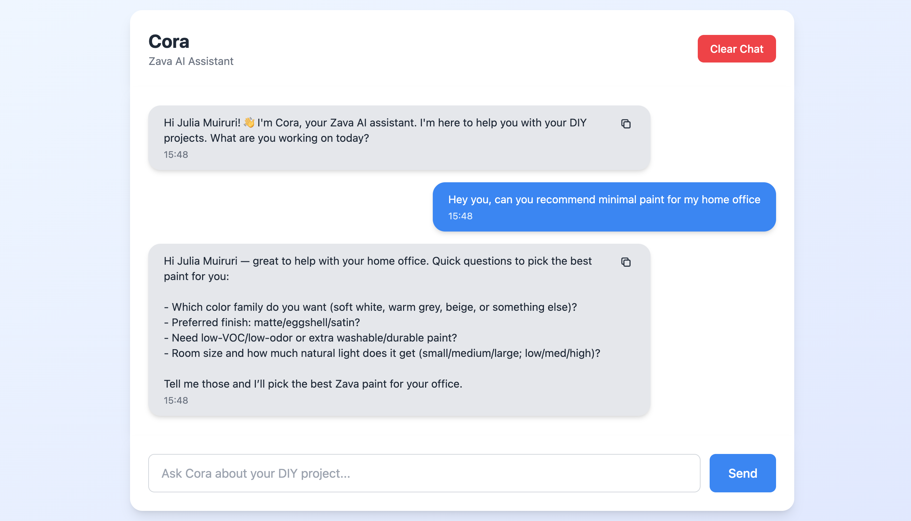

### Customization Tips 💡

**Server Enhancements:**

- **Add Authentication**: Implement API key validation in the server
- **Rate Limiting**: Track requests per IP to prevent abuse
- **Logging**: Add file-based logging for debugging production issues
- **Environment Variables**: Use dotenv to configure API keys and endpoints

**UI Enhancements:**

- **Dark Mode**: Add a theme toggle button using Tailwind's dark mode utilities
- **Save Chats**: Use localStorage to persist conversation history between sessions
- **File Uploads**: Add support for image/document uploads if your agent handles them
- **Typing Indicator**: Show "Agent is typing..." animation while waiting for response
- **Export Chat**: Add button to download conversation as text or JSON

This gives you a complete and ready chat application for your AI agent! 🚀

## AI Note

> This quest was partially created with the help of AI. The author reviewed and revised the content to ensure accuracy and quality.
